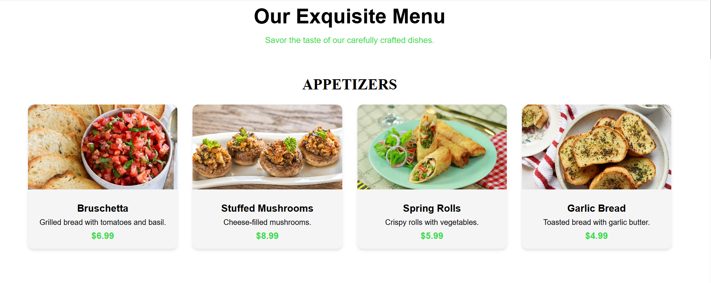
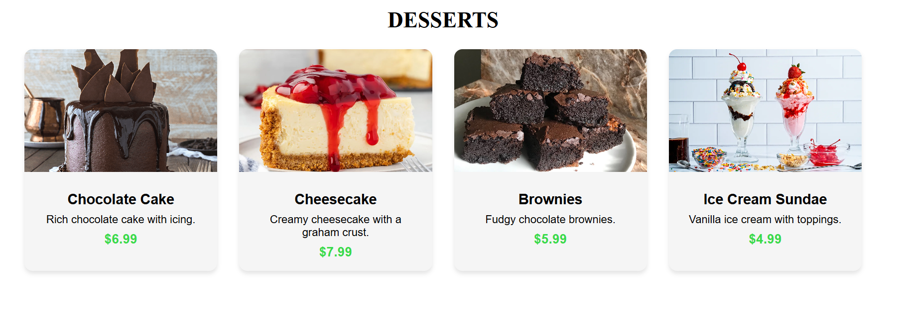

# BistroX – Modern Restaurant Website Template (Next.js + Custom CSS)


## ✨ Overview

**BistroX** is a professionally designed, fully responsive restaurant website template built with **Next.js** and **custom CSS**. It's perfect for restaurants, cafes, food delivery services, or any dining-related businesses.

## 🚀 Features

- Built with **Next.js**
- Custom CSS (no frameworks)
- Fully responsive (mobile/tablet/desktop)
- Smooth animations
- Clean and modular code
- Easy to customize
- SEO-friendly

## 📁 Folder Structure

```bistrox-nextjs-template/
│
├── restaurant-template/          → Your actual Next.js project
│   ├── pages/
│   ├── public/
│   ├── components/
│   ├── styles/
│   ├── package.json
│   ├── next.config.js (if any)
│   └── README.md (basic usage instructions)
│
├── documentation/
│   └── index.html                → How to install & customize
│
├── preview/
│   ├── thumbnail.jpg             → 590x300 (required)
│   ├── preview1.jpg              → Home page screenshot
│   └── preview2.jpg              → Menu/Contact/etc.
│
├── license.txt                   → ThemeForest Regular License
└── README.txt                    → Optional plain-text version
```


## 💻 Installation

## Installation
1. `npm install`
2. `npm run dev`
3. Open http://localhost:3000

🌐 Deployment
You can deploy this template easily to:

Vercel

Netlify

Any Node.js supported server

## 📸 Screenshots

### 🏠 Homepage


### 🍽️ Menu Section


### 🖼️ ThemeForest Thumbnail


📄 License
This project is licensed under the Envato Market Regular License – for ThemeForest sale.

🙋‍♀️ Author
Designed & Developed by Areeba Nafees
Follow for more Next.js templates and frontend projects.
